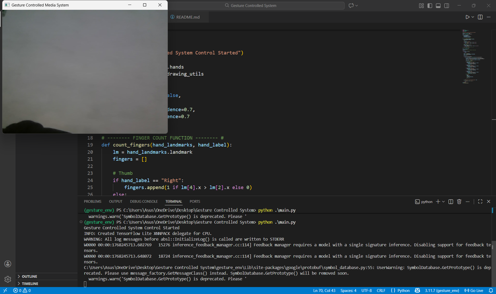
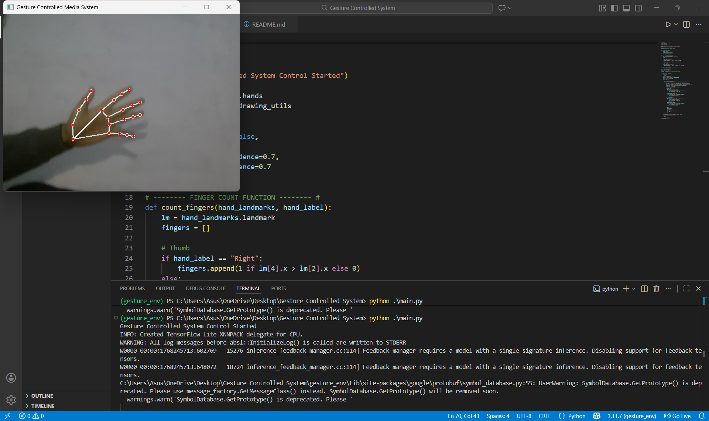
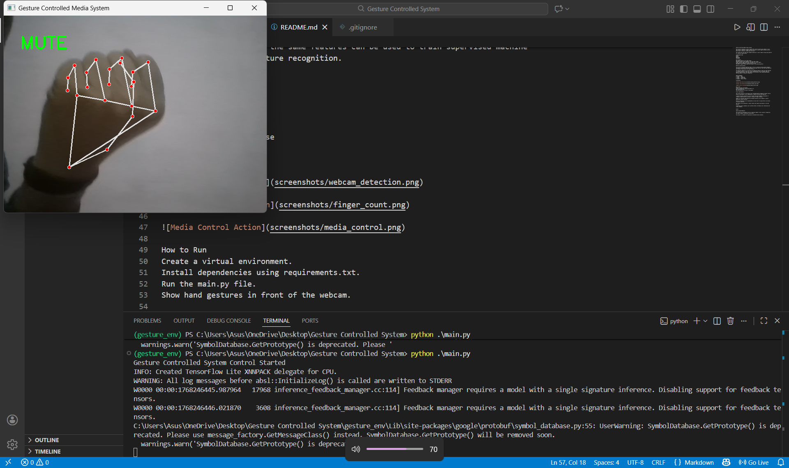

## Gesture Controlled Media Player System

This project implements a gesture-based media control system using computer vision.
Hand gestures captured through a webcam are used to control media functions such as
play, pause, volume up, volume down, and mute.

The system uses real-time hand landmark detection to count fingers and map each gesture
to a specific media action.

# Technologies Used
Python
OpenCV
MediaPipe
PyAutoGUI

# How It Works
The webcam captures live video frames.
MediaPipe detects hand landmarks from the video stream.
Finger counting logic identifies the number of raised fingers.
Each gesture is mapped to a media control action.
PyAutoGUI triggers system media keys based on the detected gesture.

# Machine Learning Aspect

This project leverages MediaPipe Hands, which is a machine learning based framework
trained on large-scale hand pose datasets. The model performs real-time hand detection
and landmark localization with high accuracy.

The detected landmarks are converted into numerical features, which are then analyzed
to recognize gestures. While the current implementation uses rule-based logic for
gesture classification, the same features can be used to train supervised machine
learning models for gesture recognition.

# Gesture Mapping
0 Fingers - Mute
1 Finger  - Volume Up
2 Fingers - Volume Down
5 Fingers - Play or Pause

# Screenshots

.png)

.png)

# How to Run
Create a virtual environment.
Install dependencies using requirements.txt.
Run the main.py file.
Show hand gestures in front of the webcam.

# Future Improvements

The current version of the project uses rule-based gesture mapping for media control.
Several enhancements can be implemented to improve accuracy and usability.

A machine learning classifier can be trained using hand landmark coordinates to
recognize complex gestures instead of relying on finger counting.

Support for multiple hand gestures and dynamic gestures can be added to control
additional system functions.

Gesture customization can be implemented to allow users to assign their own actions
to specific gestures.

The system can be optimized to reduce latency and improve performance on low-end
devices.

Integration with a graphical user interface (GUI) can enhance user interaction and
visual feedback.

Author

Aditya Singh Bhadauria

This project was developed as part of learning computer vision, gesture recognition,
and human computer interaction using Python.

The project is intended for educational and demonstration purposes.

